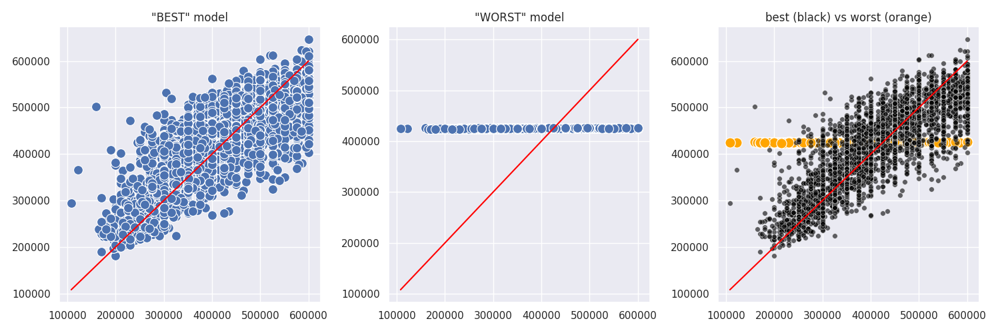
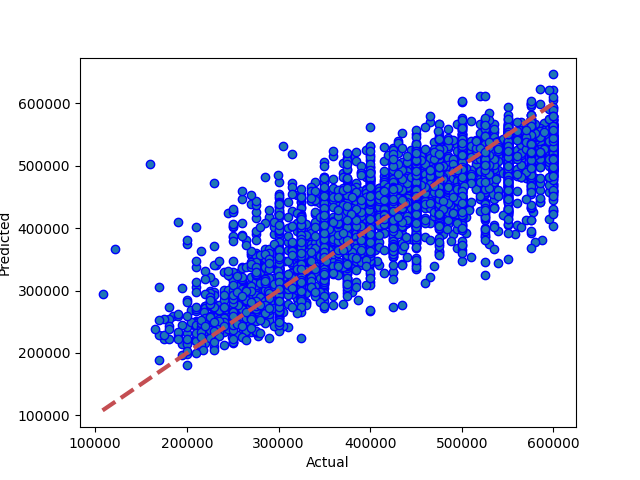
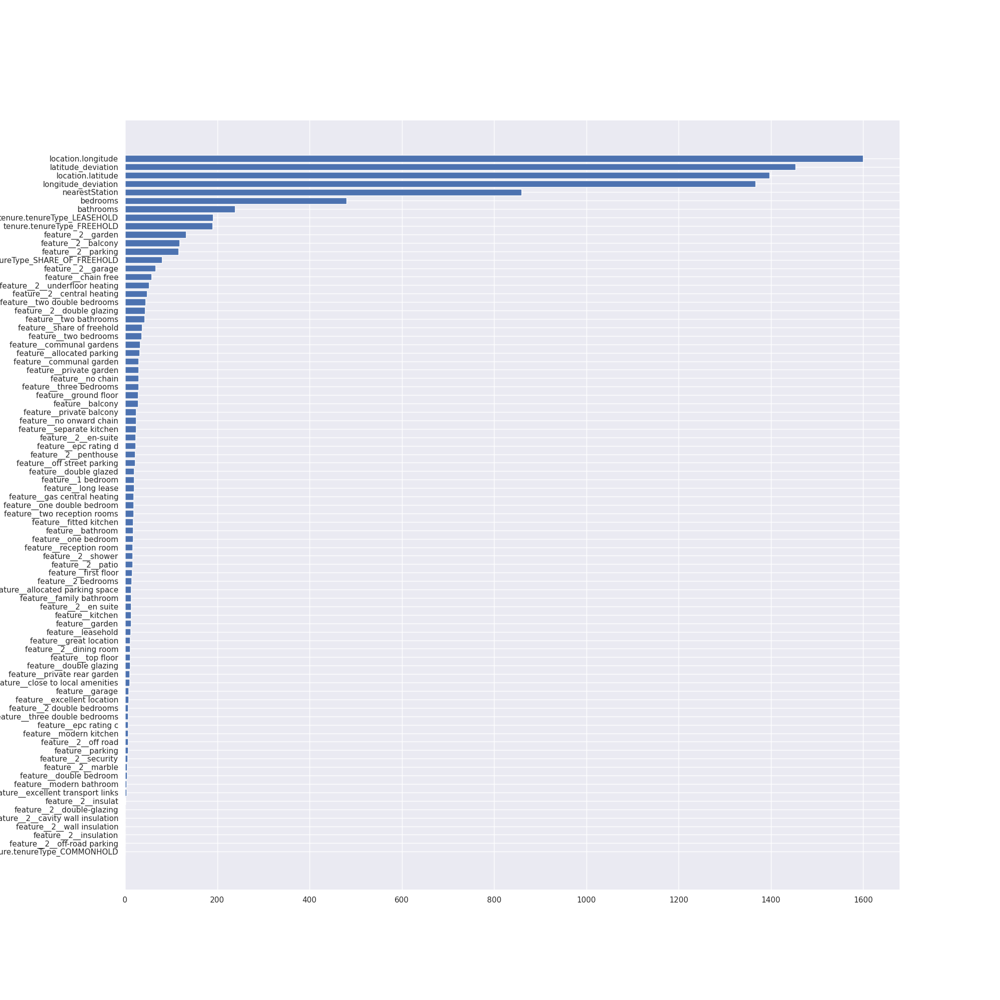
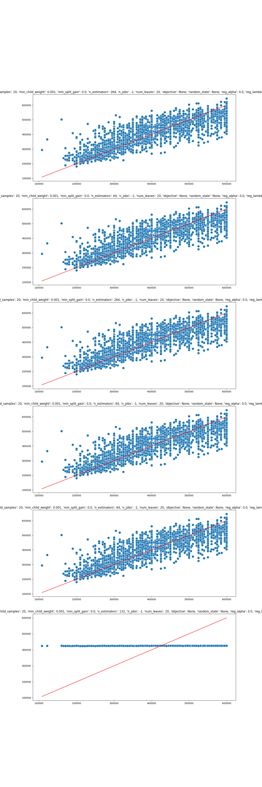

# Results from Light Gradient Boosting
### Dataset Version: 11
Date run: 2023-02-07 21:56:59.018337

Start time: 2023-02-07 21:30:49.501242

End time: 2023-02-07 21:56:59.018328

## Results
### Summary
pickled new version of model
0.7127060941481071 is new best score (it's better than -999)

### Tuned Models ranked by performance, with parameter details
|   rank_test_score |   mean_test_score |   mean_fit_time |   mean_score_time |   param_model__verbose |   param_model__num_leaves |   param_model__num_iterations |   param_model__n_estimators |   param_model__min_child_samples | param_model__metric   |   param_model__learning_rate | param_model__is_unbalance   |   param_model__colsample_bytree | param_model__boosting_type   | params2                                   |
|------------------:|------------------:|----------------:|------------------:|-----------------------:|--------------------------:|------------------------------:|----------------------------:|---------------------------------:|:----------------------|-----------------------------:|:----------------------------|--------------------------------:|:-----------------------------|:------------------------------------------|
|                 1 |          0.701157 |       17.1445   |         0.465335  |                      1 |                        20 |                           500 |                         264 |                               20 | auc                   |                        0.5   | False                       |                             0.6 | dart                         | 1/20/500/264/20/auc/0.5/False/0.6/dart    |
|                 2 |          0.67289  |       27.9789   |         1.61556   |                      1 |                        20 |                          1000 |                          64 |                               20 | auc                   |                        0.5   | True                        |                             0.6 | gbdt                         | 1/20/1000/64/20/auc/0.5/True/0.6/gbdt     |
|                 2 |          0.67289  |       42.7332   |         1.16615   |                      1 |                        20 |                          1000 |                         132 |                               20 | auc                   |                        0.5   | True                        |                             0.6 | gbdt                         | 1/20/1000/132/20/auc/0.5/True/0.6/gbdt    |
|                 4 |          0.670483 |       20.7087   |         0.243558  |                      1 |                        20 |                           100 |                         132 |                               20 | auc                   |                        0.5   | False                       |                             0.6 | dart                         | 1/20/100/132/20/auc/0.5/False/0.6/dart    |
|                 5 |          0.657581 |        0.331033 |         0.0295614 |                      1 |                        20 |                            50 |                         264 |                               20 | auc                   |                        0.5   | False                       |                             0.6 | gbdt                         | 1/20/50/264/20/auc/0.5/False/0.6/gbdt     |
|                 6 |          0.640975 |        1.56662  |         0.031774  |                      1 |                        20 |                            25 |                         132 |                               20 | auc                   |                        0.5   | True                        |                             0.6 | gbdt                         | 1/20/25/132/20/auc/0.5/True/0.6/gbdt      |
|                 6 |          0.640975 |        0.45972  |         0.0295459 |                      1 |                        20 |                            25 |                         132 |                               20 | auc                   |                        0.5   | False                       |                             0.6 | gbdt                         | 1/20/25/132/20/auc/0.5/False/0.6/gbdt     |
|                 8 |          0.632825 |        1.07823  |         0.0655626 |                      1 |                        20 |                            50 |                          64 |                               20 | auc                   |                        0.5   | True                        |                             0.6 | goss                         | 1/20/50/64/20/auc/0.5/True/0.6/goss       |
|                 9 |          0.631092 |        0.470125 |         0.0550268 |                      1 |                        20 |                           100 |                         132 |                               20 | auc                   |                        0.5   | True                        |                             0.6 | goss                         | 1/20/100/132/20/auc/0.5/True/0.6/goss     |
|                10 |          0.627268 |       17.9535   |         1.26023   |                      1 |                        20 |                          1000 |                         264 |                               20 | auc                   |                        0.005 | True                        |                             0.6 | goss                         | 1/20/1000/264/20/auc/0.005/True/0.6/goss  |
|                10 |          0.627268 |       44.4439   |         0.94764   |                      1 |                        20 |                          1000 |                         132 |                               20 | auc                   |                        0.005 | False                       |                             0.6 | goss                         | 1/20/1000/132/20/auc/0.005/False/0.6/goss |
|                12 |          0.570437 |        1.84267  |         0.229174  |                      1 |                        20 |                           500 |                          64 |                               20 | auc                   |                        0.005 | True                        |                             0.6 | goss                         | 1/20/500/64/20/auc/0.005/True/0.6/goss    |
|                13 |          0.567709 |        3.0652   |         0.452771  |                      1 |                        20 |                           500 |                         264 |                               20 | auc                   |                        0.005 | True                        |                             0.6 | gbdt                         | 1/20/500/264/20/auc/0.005/True/0.6/gbdt   |
|                14 |          0.523862 |       33.8524   |         1.06545   |                      1 |                        20 |                          1000 |                         132 |                               20 | auc                   |                        0.5   | False                       |                             0.6 | goss                         | 1/20/1000/132/20/auc/0.5/False/0.6/goss   |
|                15 |          0.466897 |        0.944329 |         0.0837437 |                      1 |                        20 |                            25 |                         264 |                               20 | auc                   |                        0.05  | True                        |                             0.6 | goss                         | 1/20/25/264/20/auc/0.05/True/0.6/goss     |
|                16 |          0.306738 |        5.11783  |         0.149084  |                      1 |                        20 |                            50 |                          64 |                               20 | auc                   |                        0.05  | False                       |                             0.6 | dart                         | 1/20/50/64/20/auc/0.05/False/0.6/dart     |
|                17 |          0.280954 |        1.56999  |         0.161542  |                      1 |                        20 |                           100 |                         132 |                               20 | auc                   |                        0.005 | False                       |                             0.6 | gbdt                         | 1/20/100/132/20/auc/0.005/False/0.6/gbdt  |
### Best and worst models obtained by tuning

### Best Model: Comparing model predictions to actual property values

## Feature Importances
### Feature Importances
1. features 4 (1600.000000)		location.longitude
2. features 5 (1454.000000)		latitude_deviation
3. features 3 (1397.000000)		location.latitude
4. features 6 (1367.000000)		longitude_deviation
5. features 2 (860.000000)		nearestStation
6. features 0 (480.000000)		bedrooms
7. features 1 (238.000000)		bathrooms
8. features 81 (191.000000)		tenure.tenureType_LEASEHOLD
9. features 80 (190.000000)		tenure.tenureType_FREEHOLD
10. features 57 (132.000000)		feature__2__garden
11. features 71 (118.000000)		feature__2__balcony
12. features 59 (116.000000)		feature__2__parking
13. features 82 (80.000000)		tenure.tenureType_SHARE_OF_FREEHOLD
14. features 67 (66.000000)		feature__2__garage
15. features 14 (57.000000)		feature__chain free
16. features 77 (52.000000)		feature__2__underfloor heating
17. features 58 (48.000000)		feature__2__central heating
18. features 55 (44.000000)		feature__two double bedrooms
19. features 73 (43.000000)		feature__2__double glazing
20. features 53 (42.000000)		feature__two bathrooms
21. features 49 (37.000000)		feature__share of freehold
22. features 54 (36.000000)		feature__two bedrooms
23. features 17 (32.000000)		feature__communal gardens
24. features 10 (31.000000)		feature__allocated parking
25. features 16 (29.000000)		feature__communal garden
26. features 45 (29.000000)		feature__private garden
27. features 38 (29.000000)		feature__no chain
28. features 50 (29.000000)		feature__three bedrooms
29. features 32 (28.000000)		feature__ground floor
30. features 12 (28.000000)		feature__balcony
31. features 44 (24.000000)		feature__private balcony
32. features 39 (24.000000)		feature__no onward chain
33. features 48 (24.000000)		feature__separate kitchen
34. features 68 (23.000000)		feature__2__en-suite
35. features 22 (23.000000)		feature__epc rating d
36. features 70 (22.000000)		feature__2__penthouse
37. features 40 (22.000000)		feature__off street parking
38. features 19 (20.000000)		feature__double glazed
39. features 7 (19.000000)		feature__1 bedroom
40. features 35 (19.000000)		feature__long lease
41. features 30 (18.000000)		feature__gas central heating
42. features 42 (18.000000)		feature__one double bedroom
43. features 56 (18.000000)		feature__two reception rooms
44. features 27 (17.000000)		feature__fitted kitchen
45. features 13 (17.000000)		feature__bathroom
46. features 41 (17.000000)		feature__one bedroom
47. features 47 (16.000000)		feature__reception room
48. features 61 (16.000000)		feature__2__shower
49. features 76 (16.000000)		feature__2__patio
50. features 26 (15.000000)		feature__first floor
51. features 8 (14.000000)		feature__2 bedrooms
52. features 11 (13.000000)		feature__allocated parking space
53. features 25 (13.000000)		feature__family bathroom
54. features 69 (13.000000)		feature__2__en suite
55. features 33 (13.000000)		feature__kitchen
56. features 29 (13.000000)		feature__garden
57. features 34 (12.000000)		feature__leasehold
58. features 31 (11.000000)		feature__great location
59. features 66 (11.000000)		feature__2__dining room
60. features 52 (11.000000)		feature__top floor
61. features 20 (11.000000)		feature__double glazing
62. features 46 (10.000000)		feature__private rear garden
63. features 15 (10.000000)		feature__close to local amenities
64. features 28 (8.000000)		feature__garage
65. features 23 (8.000000)		feature__excellent location
66. features 9 (7.000000)		feature__2 double bedrooms
67. features 51 (7.000000)		feature__three double bedrooms
68. features 21 (6.000000)		feature__epc rating c
69. features 37 (6.000000)		feature__modern kitchen
70. features 60 (6.000000)		feature__2__off road
71. features 43 (6.000000)		feature__parking
72. features 75 (5.000000)		feature__2__security
73. features 78 (4.000000)		feature__2__marble
74. features 18 (4.000000)		feature__double bedroom
75. features 36 (3.000000)		feature__modern bathroom
76. features 24 (3.000000)		feature__excellent transport links
77. features 65 (1.000000)		feature__2__insulat
78. features 72 (0.000000)		feature__2__double-glazing
79. features 62 (0.000000)		feature__2__cavity wall insulation
80. features 63 (0.000000)		feature__2__wall insulation
81. features 64 (0.000000)		feature__2__insulation
82. features 74 (0.000000)		feature__2__off-road parking
83. features 79 (0.000000)		tenure.tenureType_COMMONHOLD

### Feature Importances (Light Gradient Boosting)

## Comparison with other models
### Comparison with version 11 performances
|                               |   best score |   best time |   Mean Absolute Error Accuracy |   Mean Squared Error Accuracy |   R square Accuracy |   Root Mean Squared Error | best run date              | best method   |
|:------------------------------|-------------:|------------:|-------------------------------:|------------------------------:|--------------------:|--------------------------:|:---------------------------|:--------------|
| light gradient boosting (v11) |     0.712706 |     878.977 |                        43935.7 |                   3.24539e+09 |            0.712706 |                   56968.3 | 2023-02-07 21:56:57.820129 | random search |
### Comparison with all model performances
|                               |   best score |   best time |   Mean Absolute Error Accuracy |   Mean Squared Error Accuracy |   R square Accuracy |   Root Mean Squared Error | best run date              | best method   |
|:------------------------------|-------------:|------------:|-------------------------------:|------------------------------:|--------------------:|--------------------------:|:---------------------------|:--------------|
| light gradient boosting (v11) |     0.712706 |     878.977 |                        43935.7 |                   3.24539e+09 |            0.712706 |                   56968.3 | 2023-02-07 21:56:57.820129 | random search |
## Appendix
### Data Sample
|     iddd |   Price |   bedrooms |   bathrooms |   nearestStation |   location.latitude |   location.longitude |   latitude_deviation |   longitude_deviation | tenure.tenureType   |   feature__1 bedroom |   feature__2 bedrooms |   feature__2 double bedrooms |   feature__allocated parking |   feature__allocated parking space |   feature__balcony |   feature__bathroom |   feature__chain free |   feature__close to local amenities |   feature__communal garden |   feature__communal gardens |   feature__double bedroom |   feature__double glazed |   feature__double glazing |   feature__epc rating c |   feature__epc rating d |   feature__excellent location |   feature__excellent transport links |   feature__family bathroom |   feature__first floor |   feature__fitted kitchen |   feature__garage |   feature__garden |   feature__gas central heating |   feature__great location |   feature__ground floor |   feature__kitchen |   feature__leasehold |   feature__long lease |   feature__modern bathroom |   feature__modern kitchen |   feature__no chain |   feature__no onward chain |   feature__off street parking |   feature__one bedroom |   feature__one double bedroom |   feature__parking |   feature__private balcony |   feature__private garden |   feature__private rear garden |   feature__reception room |   feature__separate kitchen |   feature__share of freehold |   feature__three bedrooms |   feature__three double bedrooms |   feature__top floor |   feature__two bathrooms |   feature__two bedrooms |   feature__two double bedrooms |   feature__two reception rooms |   feature__2__garden |   feature__2__central heating |   feature__2__parking |   feature__2__off road |   feature__2__shower |   feature__2__cavity wall insulation |   feature__2__wall insulation |   feature__2__insulation |   feature__2__insulat |   feature__2__dining room |   feature__2__garage |   feature__2__en-suite |   feature__2__en suite |   feature__2__penthouse |   feature__2__balcony |   feature__2__double-glazing |   feature__2__double glazing |   feature__2__off-road parking |   feature__2__security |   feature__2__patio |   feature__2__underfloor heating |   feature__2__marble |
|---------:|--------:|-----------:|------------:|-----------------:|--------------------:|---------------------:|---------------------:|----------------------:|:--------------------|---------------------:|----------------------:|-----------------------------:|-----------------------------:|-----------------------------------:|-------------------:|--------------------:|----------------------:|------------------------------------:|---------------------------:|----------------------------:|--------------------------:|-------------------------:|--------------------------:|------------------------:|------------------------:|------------------------------:|-------------------------------------:|---------------------------:|-----------------------:|--------------------------:|------------------:|------------------:|-------------------------------:|--------------------------:|------------------------:|-------------------:|---------------------:|----------------------:|---------------------------:|--------------------------:|--------------------:|---------------------------:|------------------------------:|-----------------------:|------------------------------:|-------------------:|---------------------------:|--------------------------:|-------------------------------:|--------------------------:|----------------------------:|-----------------------------:|--------------------------:|---------------------------------:|---------------------:|-------------------------:|------------------------:|-------------------------------:|-------------------------------:|---------------------:|------------------------------:|----------------------:|-----------------------:|---------------------:|-------------------------------------:|------------------------------:|-------------------------:|----------------------:|--------------------------:|---------------------:|-----------------------:|-----------------------:|------------------------:|----------------------:|-----------------------------:|-----------------------------:|-------------------------------:|-----------------------:|--------------------:|---------------------------------:|---------------------:|
| 14520525 |  550000 |          3 |           1 |         0.274316 |             51.5299 |            -0.20702  |             0.03023  |              0.1026   | LEASEHOLD           |                    0 |                     0 |                            0 |                            0 |                                  0 |                  0 |                   0 |                     0 |                                   0 |                          0 |                           0 |                         0 |                        0 |                         0 |                       0 |                       0 |                             0 |                                    0 |                          0 |                      0 |                         0 |                 0 |                 0 |                              0 |                         0 |                       0 |                  0 |                    1 |                     0 |                          0 |                         0 |                   0 |                          0 |                             0 |                      0 |                             0 |                  0 |                          1 |                         0 |                              0 |                         0 |                           1 |                            0 |                         0 |                                0 |                    0 |                        0 |                       0 |                              0 |                              0 |                    0 |                             0 |                     0 |                      0 |                    0 |                                    0 |                             0 |                        0 |                     0 |                         0 |                    0 |                      0 |                      0 |                       0 |                     1 |                            0 |                            0 |                              0 |                      0 |                   0 |                                0 |                    0 |
| 27953107 |  400000 |          2 |           2 |         0.305845 |             51.5494 |            -0.4826   |             0.04967  |              0.37818  | LEASEHOLD           |                    0 |                     0 |                            0 |                            1 |                                  0 |                  1 |                   0 |                     0 |                                   0 |                          0 |                           0 |                         0 |                        0 |                         0 |                       0 |                       0 |                             0 |                                    0 |                          1 |                      0 |                         0 |                 0 |                 0 |                              0 |                         0 |                       0 |                  0 |                    0 |                     0 |                          0 |                         0 |                   0 |                          0 |                             0 |                      0 |                             0 |                  0 |                          0 |                         0 |                              0 |                         0 |                           0 |                            0 |                         0 |                                0 |                    1 |                        0 |                       0 |                              1 |                              0 |                    0 |                             0 |                     1 |                      0 |                    0 |                                    0 |                             0 |                        0 |                     0 |                         0 |                    0 |                      1 |                      0 |                       0 |                     1 |                            0 |                            0 |                              0 |                      0 |                   0 |                                0 |                    0 |
| 33593487 |  579950 |          2 |           1 |         0.438045 |             51.4472 |            -0.33877  |             0.05254  |              0.23435  | FREEHOLD            |                    0 |                     0 |                            1 |                            0 |                                  0 |                  0 |                   0 |                     0 |                                   0 |                          0 |                           0 |                         0 |                        0 |                         0 |                       0 |                       0 |                             0 |                                    0 |                          0 |                      0 |                         0 |                 0 |                 0 |                              0 |                         0 |                       0 |                  0 |                    0 |                     0 |                          0 |                         0 |                   0 |                          1 |                             0 |                      0 |                             0 |                  0 |                          0 |                         0 |                              0 |                         0 |                           0 |                            0 |                         0 |                                0 |                    0 |                        0 |                       0 |                              0 |                              0 |                    1 |                             0 |                     0 |                      0 |                    0 |                                    0 |                             0 |                        0 |                     0 |                         1 |                    0 |                      0 |                      0 |                       0 |                     0 |                            0 |                            0 |                              0 |                      0 |                   0 |                                0 |                    0 |
| 35271294 |  370000 |          2 |           1 |         0.399307 |             51.4496 |            -0.140154 |             0.050152 |              0.035734 | LEASEHOLD           |                    0 |                     0 |                            0 |                            0 |                                  0 |                  1 |                   0 |                     0 |                                   0 |                          0 |                           0 |                         0 |                        0 |                         1 |                       0 |                       0 |                             0 |                                    0 |                          0 |                      0 |                         0 |                 0 |                 0 |                              0 |                         1 |                       0 |                  0 |                    0 |                     0 |                          0 |                         0 |                   0 |                          0 |                             0 |                      0 |                             0 |                  0 |                          0 |                         0 |                              0 |                         0 |                           0 |                            0 |                         0 |                                0 |                    0 |                        0 |                       0 |                              0 |                              0 |                    0 |                             0 |                     0 |                      0 |                    0 |                                    0 |                             0 |                        0 |                     0 |                         0 |                    0 |                      0 |                      0 |                       0 |                     1 |                            0 |                            1 |                              0 |                      0 |                   0 |                                0 |                    0 |
| 44749111 |  475000 |          2 |           1 |         0.41055  |             51.37   |            -0.21241  |             0.12967  |              0.10799  | FREEHOLD            |                    0 |                     0 |                            0 |                            0 |                                  0 |                  0 |                   0 |                     0 |                                   0 |                          0 |                           0 |                         0 |                        0 |                         0 |                       0 |                       0 |                             0 |                                    0 |                          0 |                      0 |                         1 |                 0 |                 0 |                              0 |                         0 |                       0 |                  0 |                    0 |                     0 |                          0 |                         0 |                   0 |                          0 |                             0 |                      0 |                             0 |                  0 |                          0 |                         0 |                              0 |                         0 |                           0 |                            0 |                         0 |                                0 |                    0 |                        0 |                       0 |                              0 |                              0 |                    1 |                             0 |                     0 |                      0 |                    1 |                                    0 |                             0 |                        0 |                     0 |                         0 |                    0 |                      0 |                      0 |                       0 |                     0 |                            0 |                            1 |                              0 |                      0 |                   0 |                                0 |                    0 |
### Hyperparameter options for Randomized Grid Search
model__boosting_type = ['gbdt', 'rf', 'dart', 'goss']

model__colsample_bytree = [0.6]

model__is_unbalance = [True, False]

model__learning_rate = [0.0005, 0.005, 0.05, 0.5, 5]

model__metric = ['auc']

model__min_child_samples = [20]

model__n_estimators = [64, 132, 264]

model__num_iterations = [25, 50, 100, 500, 1000]

model__num_leaves = [20]

model__verbose = [1]

### Range of hyperparameter results

### Environment Variables
notebook_environment = gradient

use_gpu = True

debug_mode = False

quick_mode = False

quick_override_cv_splits = 2

quick_override_n_iter = 10

quick_override_n_jobs = 3

