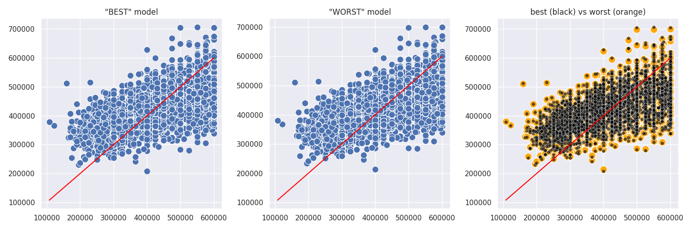
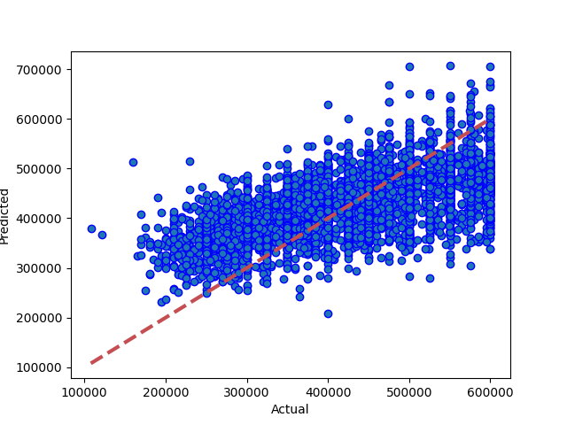
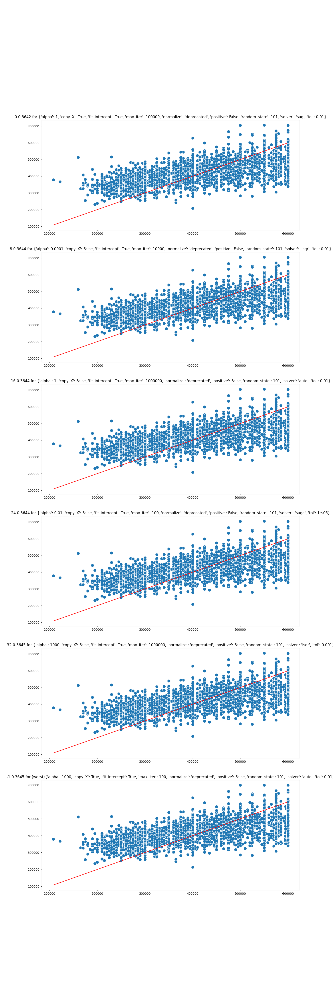

# Results from Linear Regression (Ridge)
### Dataset Version: 11
Date run: 2023-02-02 02:06:10.237792

Start time: 2023-02-02 02:05:12.606895

End time: 2023-02-02 02:06:10.237783

## Results
### Summary
pickled new version of model
0.36416464812594385 is new best score (it's better than -999)

### Tuned Models ranked by performance, with parameter details
|   rank_test_score |   mean_test_score |   mean_fit_time |   mean_score_time |   param_model__tol | param_model__solver   |   param_model__random_state | param_model__positive   |   param_model__max_iter | param_model__fit_intercept   | param_model__copy_X   |   param_model__alpha | params2                                     |
|------------------:|------------------:|----------------:|------------------:|-------------------:|:----------------------|----------------------------:|:------------------------|------------------------:|:-----------------------------|:----------------------|---------------------:|:--------------------------------------------|
|                 1 |          0.372485 |       0.314704  |        0.00645296 |             0.01   | sag                   |                         101 | False                   |                  100000 | True                         | True                  |                    1 | 0.01/sag/101/False/100000/True/True/1       |
|                 2 |          0.372444 |       0.0737461 |        0.00731802 |             0.0001 | lsqr                  |                         101 | False                   |                 1000000 | True                         | True                  |                  100 | 0.0001/lsqr/101/False/1000000/True/True/100 |
|                 3 |          0.372444 |       0.755177  |        0.00852585 |             1e-05  | sag                   |                         101 | False                   |                     100 | True                         | True                  |                  100 | 1e-05/sag/101/False/100/True/True/100       |
|                 3 |          0.372444 |       0.792876  |        0.00710305 |             1e-05  | sag                   |                         101 | False                   |                  100000 | True                         | False                 |                  100 | 1e-05/sag/101/False/100000/True/False/100   |
|                 5 |          0.372444 |       0.185347  |        0.00739455 |             0.001  | svd                   |                         101 | False                   |                  100000 | True                         | False                 |                  100 | 0.001/svd/101/False/100000/True/False/100   |
|                 5 |          0.372444 |       0.176457  |        0.00770052 |             0.001  | svd                   |                         101 | False                   |                  100000 | True                         | True                  |                  100 | 0.001/svd/101/False/100000/True/True/100    |
|                 7 |          0.372443 |       0.060605  |        0.00763512 |             0.01   | lsqr                  |                         101 | False                   |                  100000 | True                         | False                 |                   10 | 0.01/lsqr/101/False/100000/True/False/10    |
### Best and worst models obtained by tuning

### Best Model: Comparing model predictions to actual property values

## Comparison with other models
### Comparison with version 11 performances
|                                 |   best score |   best time |   Mean Absolute Error Accuracy |   Mean Squared Error Accuracy |   R square Accuracy |   Root Mean Squared Error | best run date              | best method                     |
|:--------------------------------|-------------:|------------:|-------------------------------:|------------------------------:|--------------------:|--------------------------:|:---------------------------|:--------------------------------|
| linear regression (ridge) (v11) |     0.364165 |    0.565877 |                        68637.1 |                   7.18265e+09 |            0.364165 |                   84750.5 | 2023-02-02 02:06:09.257493 | random search(pca,0.99% retain) |
### Comparison with all model performances
|                                 |   best score |   best time |   Mean Absolute Error Accuracy |   Mean Squared Error Accuracy |   R square Accuracy |   Root Mean Squared Error | best run date              | best method                     |
|:--------------------------------|-------------:|------------:|-------------------------------:|------------------------------:|--------------------:|--------------------------:|:---------------------------|:--------------------------------|
| linear regression (ridge) (v11) |     0.364165 |    0.565877 |                        68637.1 |                   7.18265e+09 |            0.364165 |                   84750.5 | 2023-02-02 02:06:09.257493 | random search(pca,0.99% retain) |
## Appendix
### Data Sample
|     iddd |   Price |   bedrooms |   bathrooms |   nearestStation |   location.latitude |   location.longitude |   latitude_deviation |   longitude_deviation | tenure.tenureType   |   feature__1 bedroom |   feature__2 bedrooms |   feature__2 double bedrooms |   feature__allocated parking |   feature__allocated parking space |   feature__balcony |   feature__bathroom |   feature__chain free |   feature__close to local amenities |   feature__communal garden |   feature__communal gardens |   feature__double bedroom |   feature__double glazed |   feature__double glazing |   feature__epc rating c |   feature__epc rating d |   feature__excellent location |   feature__excellent transport links |   feature__family bathroom |   feature__first floor |   feature__fitted kitchen |   feature__garage |   feature__garden |   feature__gas central heating |   feature__great location |   feature__ground floor |   feature__kitchen |   feature__leasehold |   feature__long lease |   feature__modern bathroom |   feature__modern kitchen |   feature__no chain |   feature__no onward chain |   feature__off street parking |   feature__one bedroom |   feature__one double bedroom |   feature__parking |   feature__private balcony |   feature__private garden |   feature__private rear garden |   feature__reception room |   feature__separate kitchen |   feature__share of freehold |   feature__three bedrooms |   feature__three double bedrooms |   feature__top floor |   feature__two bathrooms |   feature__two bedrooms |   feature__two double bedrooms |   feature__two reception rooms |   feature__2__garden |   feature__2__central heating |   feature__2__parking |   feature__2__off road |   feature__2__shower |   feature__2__cavity wall insulation |   feature__2__wall insulation |   feature__2__insulation |   feature__2__insulat |   feature__2__dining room |   feature__2__garage |   feature__2__en-suite |   feature__2__en suite |   feature__2__penthouse |   feature__2__balcony |   feature__2__double-glazing |   feature__2__double glazing |   feature__2__off-road parking |   feature__2__security |   feature__2__patio |   feature__2__underfloor heating |   feature__2__marble |
|---------:|--------:|-----------:|------------:|-----------------:|--------------------:|---------------------:|---------------------:|----------------------:|:--------------------|---------------------:|----------------------:|-----------------------------:|-----------------------------:|-----------------------------------:|-------------------:|--------------------:|----------------------:|------------------------------------:|---------------------------:|----------------------------:|--------------------------:|-------------------------:|--------------------------:|------------------------:|------------------------:|------------------------------:|-------------------------------------:|---------------------------:|-----------------------:|--------------------------:|------------------:|------------------:|-------------------------------:|--------------------------:|------------------------:|-------------------:|---------------------:|----------------------:|---------------------------:|--------------------------:|--------------------:|---------------------------:|------------------------------:|-----------------------:|------------------------------:|-------------------:|---------------------------:|--------------------------:|-------------------------------:|--------------------------:|----------------------------:|-----------------------------:|--------------------------:|---------------------------------:|---------------------:|-------------------------:|------------------------:|-------------------------------:|-------------------------------:|---------------------:|------------------------------:|----------------------:|-----------------------:|---------------------:|-------------------------------------:|------------------------------:|-------------------------:|----------------------:|--------------------------:|---------------------:|-----------------------:|-----------------------:|------------------------:|----------------------:|-----------------------------:|-----------------------------:|-------------------------------:|-----------------------:|--------------------:|---------------------------------:|---------------------:|
| 14520525 |  550000 |          3 |           1 |         0.274316 |             51.5299 |            -0.20702  |             0.03023  |              0.1026   | LEASEHOLD           |                    0 |                     0 |                            0 |                            0 |                                  0 |                  0 |                   0 |                     0 |                                   0 |                          0 |                           0 |                         0 |                        0 |                         0 |                       0 |                       0 |                             0 |                                    0 |                          0 |                      0 |                         0 |                 0 |                 0 |                              0 |                         0 |                       0 |                  0 |                    1 |                     0 |                          0 |                         0 |                   0 |                          0 |                             0 |                      0 |                             0 |                  0 |                          1 |                         0 |                              0 |                         0 |                           1 |                            0 |                         0 |                                0 |                    0 |                        0 |                       0 |                              0 |                              0 |                    0 |                             0 |                     0 |                      0 |                    0 |                                    0 |                             0 |                        0 |                     0 |                         0 |                    0 |                      0 |                      0 |                       0 |                     1 |                            0 |                            0 |                              0 |                      0 |                   0 |                                0 |                    0 |
| 27953107 |  400000 |          2 |           2 |         0.305845 |             51.5494 |            -0.4826   |             0.04967  |              0.37818  | LEASEHOLD           |                    0 |                     0 |                            0 |                            1 |                                  0 |                  1 |                   0 |                     0 |                                   0 |                          0 |                           0 |                         0 |                        0 |                         0 |                       0 |                       0 |                             0 |                                    0 |                          1 |                      0 |                         0 |                 0 |                 0 |                              0 |                         0 |                       0 |                  0 |                    0 |                     0 |                          0 |                         0 |                   0 |                          0 |                             0 |                      0 |                             0 |                  0 |                          0 |                         0 |                              0 |                         0 |                           0 |                            0 |                         0 |                                0 |                    1 |                        0 |                       0 |                              1 |                              0 |                    0 |                             0 |                     1 |                      0 |                    0 |                                    0 |                             0 |                        0 |                     0 |                         0 |                    0 |                      1 |                      0 |                       0 |                     1 |                            0 |                            0 |                              0 |                      0 |                   0 |                                0 |                    0 |
| 33593487 |  579950 |          2 |           1 |         0.438045 |             51.4472 |            -0.33877  |             0.05254  |              0.23435  | FREEHOLD            |                    0 |                     0 |                            1 |                            0 |                                  0 |                  0 |                   0 |                     0 |                                   0 |                          0 |                           0 |                         0 |                        0 |                         0 |                       0 |                       0 |                             0 |                                    0 |                          0 |                      0 |                         0 |                 0 |                 0 |                              0 |                         0 |                       0 |                  0 |                    0 |                     0 |                          0 |                         0 |                   0 |                          1 |                             0 |                      0 |                             0 |                  0 |                          0 |                         0 |                              0 |                         0 |                           0 |                            0 |                         0 |                                0 |                    0 |                        0 |                       0 |                              0 |                              0 |                    1 |                             0 |                     0 |                      0 |                    0 |                                    0 |                             0 |                        0 |                     0 |                         1 |                    0 |                      0 |                      0 |                       0 |                     0 |                            0 |                            0 |                              0 |                      0 |                   0 |                                0 |                    0 |
| 35271294 |  370000 |          2 |           1 |         0.399307 |             51.4496 |            -0.140154 |             0.050152 |              0.035734 | LEASEHOLD           |                    0 |                     0 |                            0 |                            0 |                                  0 |                  1 |                   0 |                     0 |                                   0 |                          0 |                           0 |                         0 |                        0 |                         1 |                       0 |                       0 |                             0 |                                    0 |                          0 |                      0 |                         0 |                 0 |                 0 |                              0 |                         1 |                       0 |                  0 |                    0 |                     0 |                          0 |                         0 |                   0 |                          0 |                             0 |                      0 |                             0 |                  0 |                          0 |                         0 |                              0 |                         0 |                           0 |                            0 |                         0 |                                0 |                    0 |                        0 |                       0 |                              0 |                              0 |                    0 |                             0 |                     0 |                      0 |                    0 |                                    0 |                             0 |                        0 |                     0 |                         0 |                    0 |                      0 |                      0 |                       0 |                     1 |                            0 |                            1 |                              0 |                      0 |                   0 |                                0 |                    0 |
| 44749111 |  475000 |          2 |           1 |         0.41055  |             51.37   |            -0.21241  |             0.12967  |              0.10799  | FREEHOLD            |                    0 |                     0 |                            0 |                            0 |                                  0 |                  0 |                   0 |                     0 |                                   0 |                          0 |                           0 |                         0 |                        0 |                         0 |                       0 |                       0 |                             0 |                                    0 |                          0 |                      0 |                         1 |                 0 |                 0 |                              0 |                         0 |                       0 |                  0 |                    0 |                     0 |                          0 |                         0 |                   0 |                          0 |                             0 |                      0 |                             0 |                  0 |                          0 |                         0 |                              0 |                         0 |                           0 |                            0 |                         0 |                                0 |                    0 |                        0 |                       0 |                              0 |                              0 |                    1 |                             0 |                     0 |                      0 |                    1 |                                    0 |                             0 |                        0 |                     0 |                         0 |                    0 |                      0 |                      0 |                       0 |                     0 |                            0 |                            1 |                              0 |                      0 |                   0 |                                0 |                    0 |
### Hyperparameter options for Randomized Grid Search
model__alpha = [1e-05, 0.0001, 0.001, 0.01, 0.1, 1, 10, 100, 1000]

model__fit_intercept = [True, False]

model__max_iter = [10000, 1000, 100, 100000, 1000000]

model__positive = [False]

model__copy_X = [True, False]

model__solver = ['auto', 'svd', 'cholesky', 'lsqr', 'sparse_cg', 'sag', 'saga', 'lbfgs']

model__tol = [1e-05, 0.0001, 0.001, 0.01]

model__random_state = [101]

### Range of hyperparameter results

### Environment Variables
notebook_environment = gradient

use_gpu = True

debug_mode = False

quick_mode = False

quick_override_cv_splits = 2

quick_override_n_iter = 10

quick_override_n_jobs = 3

