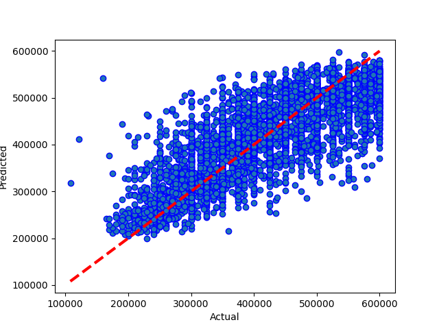
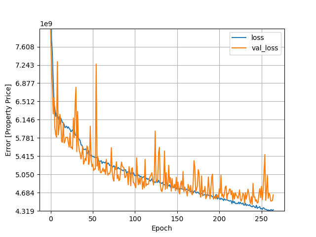

# Results from Neural Network m11 mega
### Dataset Version: 06
Date run: 2023-02-04 14:06:33.340357

Start time: 2023-02-04 13:44:54.553782

End time: 2023-02-04 14:06:32.986766

## Results
### Summary
saved (rather than pickled) new version of model
0.6035700282614043 is new best score (it's better than -999)

### Best Model: Comparing model predictions to actual property values

### Model Specific Notes
can't display hyperparameter comparison for neural network

can't display model performance graphs for neural network

can't display model performance graphs for neural network

### Neural Network Loss - Head
|    |        loss |    val_loss |   epoch |
|---:|------------:|------------:|--------:|
|  0 | 1.438e+10   | 7.97337e+09 |       0 |
|  1 | 7.78355e+09 | 7.15489e+09 |       1 |
|  2 | 7.48363e+09 | 6.82031e+09 |       2 |
|  3 | 6.94231e+09 | 6.26254e+09 |       3 |
|  4 | 6.50661e+09 | 6.58649e+09 |       4 |

### Neural Network Loss - Tail
|     |        loss |    val_loss |   epoch |
|----:|------------:|------------:|--------:|
| 260 | 4.32411e+09 | 4.63073e+09 |     260 |
| 261 | 4.34319e+09 | 4.51623e+09 |     261 |
| 262 | 4.34349e+09 | 4.5184e+09  |     262 |
| 263 | 4.31907e+09 | 4.529e+09   |     263 |
| 264 | 4.34358e+09 | 4.64345e+09 |     264 |

### Model Structure
>Model: "sequential"
>________________________________________________________________________________________________________________________________________________________________
> Layer (type)                                                           Output Shape                                                    Param #                 
>
> dense (Dense)                                                          (None, 128)                                                     1536                    
>                                                                                                                                                                
> dense_1 (Dense)                                                        (None, 256)                                                     33024                   
>                                                                                                                                                                
> dense_2 (Dense)                                                        (None, 512)                                                     131584                  
>                                                                                                                                                                
> dense_3 (Dense)                                                        (None, 1024)                                                    525312                  
>                                                                                                                                                                
> dense_4 (Dense)                                                        (None, 2148)                                                    2201700                 
>                                                                                                                                                                
> dense_5 (Dense)                                                        (None, 2148)                                                    4616052                 
>                                                                                                                                                                
> dense_6 (Dense)                                                        (None, 1024)                                                    2200576                 
>                                                                                                                                                                
> dense_7 (Dense)                                                        (None, 512)                                                     524800                  
>                                                                                                                                                                
> dense_8 (Dense)                                                        (None, 256)                                                     131328                  
>                                                                                                                                                                
> dense_9 (Dense)                                                        (None, 1)                                                       257                     
>                                                                                                                                                                
>
>Total params: 10,366,169
>Trainable params: 10,366,169
>Nontrainable params: 0
>________________________________________________________________________________________________________________________________________________________________

## Comparison with other models
### Comparison with version 06 performances
|                               |   best score |   best time |   Mean Absolute Error Accuracy |   Mean Squared Error Accuracy |   R square Accuracy |   Root Mean Squared Error | best run date              | best method                                                        |
|:------------------------------|-------------:|------------:|-------------------------------:|------------------------------:|--------------------:|--------------------------:|:---------------------------|:-------------------------------------------------------------------|
| neural network m11 mega (v06) |      0.60357 |     1291.95 |                        52150.5 |                   4.47823e+09 |             0.60357 |                   66919.6 | 2023-02-04 14:06:30.912832 | loss=4.32e+09 valloss=4.45e+09 +valsplit=0.1 +patn=25 stop=265/400 |

### Comparison with all model performances
|                               |   best score |   best time |   Mean Absolute Error Accuracy |   Mean Squared Error Accuracy |   R square Accuracy |   Root Mean Squared Error | best run date              | best method                                                        |
|:------------------------------|-------------:|------------:|-------------------------------:|------------------------------:|--------------------:|--------------------------:|:---------------------------|:-------------------------------------------------------------------|
| neural network m11 mega (v06) |      0.60357 |     1291.95 |                        52150.5 |                   4.47823e+09 |             0.60357 |                   66919.6 | 2023-02-04 14:06:30.912832 | loss=4.32e+09 valloss=4.45e+09 +valsplit=0.1 +patn=25 stop=265/400 |

## Appendix
### Data Sample
|          |   Price |   bedrooms |   bathrooms |   nearestStation |   location.latitude |   location.longitude |   latitude_deviation |   longitude_deviation | tenure.tenureType   |
|---------:|--------:|-----------:|------------:|-----------------:|--------------------:|---------------------:|---------------------:|----------------------:|:--------------------|
| 14520525 |  550000 |          3 |           1 |         0.274316 |             51.5299 |            -0.20702  |             0.03023  |              0.1026   | LEASEHOLD           |
| 27953107 |  400000 |          2 |           2 |         0.305845 |             51.5494 |            -0.4826   |             0.04967  |              0.37818  | LEASEHOLD           |
| 33593487 |  579950 |          2 |           1 |         0.438045 |             51.4472 |            -0.33877  |             0.05254  |              0.23435  | FREEHOLD            |
| 35271294 |  370000 |          2 |           1 |         0.399307 |             51.4496 |            -0.140154 |             0.050152 |              0.035734 | LEASEHOLD           |
| 44749111 |  475000 |          2 |           1 |         0.41055  |             51.37   |            -0.21241  |             0.12967  |              0.10799  | FREEHOLD            |

### Environment Variables
notebook_environment = gradient

use_gpu = True

debug_mode = False

quick_mode = False

quick_override_cv_splits = 2

quick_override_n_iter = 10

quick_override_n_jobs = 3

### Useful info
Tensorflow version: 2.9.1

