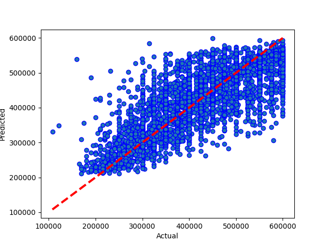
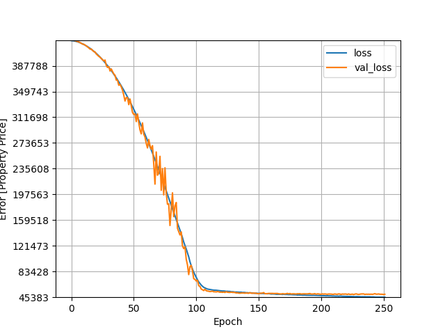

# Results from Neural Network m15 mega + dropout
### Dataset Version: 09
Date run: 2023-02-04 14:50:02.287054

Start time: 2023-02-04 14:17:48.985762

End time: 2023-02-04 14:50:02.266525

## Results
### Summary
saved (rather than pickled) new version of model
0.6187089836424251 is new best score (it's better than -999)

### Best Model: Comparing model predictions to actual property values

### Model Specific Notes
can't display hyperparameter comparison for neural network

can't display model performance graphs for neural network

can't display model performance graphs for neural network

### Neural Network Loss - Head
|    |   loss |   val_loss |   epoch |
|---:|-------:|-----------:|--------:|
|  0 | 425120 |     425833 |       0 |
|  1 | 424949 |     425577 |       1 |
|  2 | 424659 |     425299 |       2 |
|  3 | 424274 |     424854 |       3 |
|  4 | 423803 |     424484 |       4 |

### Neural Network Loss - Tail
|     |    loss |   val_loss |   epoch |
|----:|--------:|-----------:|--------:|
| 247 | 45483.2 |    49884.6 |     247 |
| 248 | 45551.1 |    49881.5 |     248 |
| 249 | 45554.1 |    49800.5 |     249 |
| 250 | 45537.6 |    49506   |     250 |
| 251 | 45488.8 |    49833.9 |     251 |

### Model Structure
>Model: "sequential"
>________________________________________________________________________________________________________________________________________________________________
> Layer (type)                                                           Output Shape                                                    Param #                 
>
> normalization (Normalization)                                          (None, 21)                                                      43                      
>                                                                                                                                                                
> dense (Dense)                                                          (None, 128)                                                     2816                    
>                                                                                                                                                                
> dense_1 (Dense)                                                        (None, 256)                                                     33024                   
>                                                                                                                                                                
> batch_normalization_1 (BatchNormalization)                             (None, 256)                                                     1024                    
>                                                                                                                                                                
> activation (Activation)                                                multiple                                                        0                       
>                                                                                                                                                                
> dense_2 (Dense)                                                        (None, 512)                                                     131584                  
>                                                                                                                                                                
> batch_normalization_2 (BatchNormalization)                             (None, 512)                                                     2048                    
>                                                                                                                                                                
> dropout (Dropout)                                                      (None, 512)                                                     0                       
>                                                                                                                                                                
> dense_3 (Dense)                                                        (None, 1024)                                                    525312                  
>                                                                                                                                                                
> batch_normalization_3 (BatchNormalization)                             (None, 1024)                                                    4096                    
>                                                                                                                                                                
> dense_4 (Dense)                                                        (None, 1024)                                                    1049600                 
>                                                                                                                                                                
> dropout_1 (Dropout)                                                    (None, 1024)                                                    0                       
>                                                                                                                                                                
> batch_normalization_4 (BatchNormalization)                             (None, 1024)                                                    4096                    
>                                                                                                                                                                
> dense_5 (Dense)                                                        (None, 512)                                                     524800                  
>                                                                                                                                                                
> batch_normalization_5 (BatchNormalization)                             (None, 512)                                                     2048                    
>                                                                                                                                                                
> dense_6 (Dense)                                                        (None, 256)                                                     131328                  
>                                                                                                                                                                
> batch_normalization_6 (BatchNormalization)                             (None, 256)                                                     1024                    
>                                                                                                                                                                
> dense_7 (Dense)                                                        (None, 1)                                                       257                     
>                                                                                                                                                                
>
>Total params: 2,413,100
>Trainable params: 2,405,889
>Nontrainable params: 7,211
>________________________________________________________________________________________________________________________________________________________________

## Comparison with other models
### Comparison with version 09 performances
|                                         |   best score |   best time |   Mean Absolute Error Accuracy |   Mean Squared Error Accuracy |   R square Accuracy |   Root Mean Squared Error | best run date              | best method                                                        |
|:----------------------------------------|-------------:|------------:|-------------------------------:|------------------------------:|--------------------:|--------------------------:|:---------------------------|:-------------------------------------------------------------------|
| neural network m15 mega + dropout (v09) |     0.618709 |     1914.71 |                        50055.3 |                   4.30722e+09 |            0.618709 |                   65629.4 | 2023-02-04 14:49:50.259984 | loss=4.55e+04 valloss=4.94e+04 +valsplit=0.1 +patn=25 stop=252/400 |

### Comparison with all model performances
|                                         |   best score |   best time |   Mean Absolute Error Accuracy |   Mean Squared Error Accuracy |   R square Accuracy |   Root Mean Squared Error | best run date              | best method                                                        |
|:----------------------------------------|-------------:|------------:|-------------------------------:|------------------------------:|--------------------:|--------------------------:|:---------------------------|:-------------------------------------------------------------------|
| neural network m15 mega + dropout (v09) |     0.618709 |     1914.71 |                        50055.3 |                   4.30722e+09 |            0.618709 |                   65629.4 | 2023-02-04 14:49:50.259984 | loss=4.55e+04 valloss=4.94e+04 +valsplit=0.1 +patn=25 stop=252/400 |

## Appendix
### Data Sample
|          |   Price |   bedrooms |   bathrooms |   nearestStation |   location.latitude |   location.longitude |   latitude_deviation |   longitude_deviation | tenure.tenureType   |   feature__balcony |   feature__chain free |   feature__no onward chain |   feature__off street parking |   feature__one bedroom |   feature__private balcony |   feature__share of freehold |   feature__three bedrooms |   feature__two bedrooms |   feature__two double bedrooms |
|---------:|--------:|-----------:|------------:|-----------------:|--------------------:|---------------------:|---------------------:|----------------------:|:--------------------|-------------------:|----------------------:|---------------------------:|------------------------------:|-----------------------:|---------------------------:|-----------------------------:|--------------------------:|------------------------:|-------------------------------:|
| 14520525 |  550000 |          3 |           1 |         0.274316 |             51.5299 |            -0.20702  |             0.03023  |              0.1026   | LEASEHOLD           |                  0 |                     0 |                          0 |                             0 |                      0 |                          1 |                            0 |                         0 |                       0 |                              0 |
| 27953107 |  400000 |          2 |           2 |         0.305845 |             51.5494 |            -0.4826   |             0.04967  |              0.37818  | LEASEHOLD           |                  1 |                     0 |                          0 |                             0 |                      0 |                          0 |                            0 |                         0 |                       0 |                              1 |
| 33593487 |  579950 |          2 |           1 |         0.438045 |             51.4472 |            -0.33877  |             0.05254  |              0.23435  | FREEHOLD            |                  0 |                     0 |                          1 |                             0 |                      0 |                          0 |                            0 |                         0 |                       0 |                              0 |
| 35271294 |  370000 |          2 |           1 |         0.399307 |             51.4496 |            -0.140154 |             0.050152 |              0.035734 | LEASEHOLD           |                  1 |                     0 |                          0 |                             0 |                      0 |                          0 |                            0 |                         0 |                       0 |                              0 |
| 44749111 |  475000 |          2 |           1 |         0.41055  |             51.37   |            -0.21241  |             0.12967  |              0.10799  | FREEHOLD            |                  0 |                     0 |                          0 |                             0 |                      0 |                          0 |                            0 |                         0 |                       0 |                              0 |

### Environment Variables
notebook_environment = gradient

use_gpu = True

debug_mode = False

quick_mode = False

quick_override_cv_splits = 2

quick_override_n_iter = 10

quick_override_n_jobs = 3

### Useful info
Tensorflow version: 2.9.1

