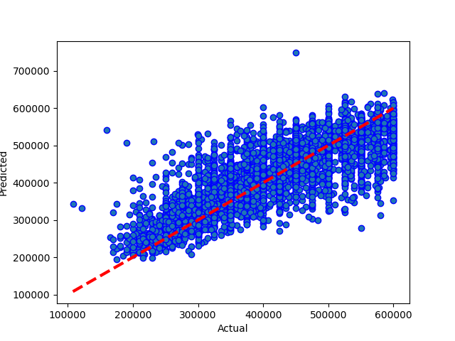

# Results from Neural Network m16 mega + dropout
### Dataset Version: 09
Date run: 2023-02-04 20:51:06.292458

Start time: 2023-02-04 20:44:27.869973

End time: 2023-02-04 20:51:05.972534

## Results
### Summary
saved (rather than pickled) new version of model
0.6185885458815552 is new best score (it's better than -999)

### Best Model: Comparing model predictions to actual property values

### Model Specific Notes
can't display hyperparameter comparison for neural network

can't display model performance graphs for neural network

can't display model performance graphs for neural network

### Neural Network Loss - Head
|    |    loss |   mean_squared_error |   val_loss |   val_mean_squared_error |   epoch |
|---:|--------:|---------------------:|-----------:|-------------------------:|--------:|
|  0 | 85816.7 |          1.6452e+10  |    61603.4 |              5.99697e+09 |       0 |
|  1 | 60427.7 |          5.89424e+09 |    56534.8 |              5.16863e+09 |       1 |
|  2 | 59118.5 |          5.6512e+09  |    56144.9 |              5.15251e+09 |       2 |
|  3 | 58343   |          5.51398e+09 |    56127.6 |              4.99384e+09 |       3 |
|  4 | 58022.1 |          5.47082e+09 |    55382.6 |              4.90526e+09 |       4 |

### Neural Network Loss - Tail
|    |    loss |   mean_squared_error |   val_loss |   val_mean_squared_error |   epoch |
|---:|--------:|---------------------:|-----------:|-------------------------:|--------:|
| 89 | 47727.4 |          4.02082e+09 |    50782.9 |              4.34092e+09 |      89 |
| 90 | 47736.1 |          4.02503e+09 |    50707   |              4.33649e+09 |      90 |
| 91 | 47613.8 |          4.00111e+09 |    51292.9 |              4.43204e+09 |      91 |
| 92 | 47867.3 |          4.03806e+09 |    51019.4 |              4.33098e+09 |      92 |
| 93 | 47476.2 |          3.98952e+09 |    50700.9 |              4.33636e+09 |      93 |

### Model Structure
>Model: "sequential"
>________________________________________________________________________________________________________________________________________________________________
> Layer (type)                                                           Output Shape                                                    Param #                 
>
> normalization (Normalization)                                          (None, 21)                                                      43                      
>                                                                                                                                                                
> dense (Dense)                                                          (None, 128)                                                     2816                    
>                                                                                                                                                                
> dense_1 (Dense)                                                        (None, 256)                                                     33024                   
>                                                                                                                                                                
> activation (Activation)                                                multiple                                                        0                       
>                                                                                                                                                                
> dense_2 (Dense)                                                        (None, 512)                                                     131584                  
>                                                                                                                                                                
> dropout (Dropout)                                                      (None, 512)                                                     0                       
>                                                                                                                                                                
> dense_3 (Dense)                                                        (None, 1024)                                                    525312                  
>                                                                                                                                                                
> dense_4 (Dense)                                                        (None, 1024)                                                    1049600                 
>                                                                                                                                                                
> dropout_1 (Dropout)                                                    (None, 1024)                                                    0                       
>                                                                                                                                                                
> dense_5 (Dense)                                                        (None, 512)                                                     524800                  
>                                                                                                                                                                
> dense_6 (Dense)                                                        (None, 256)                                                     131328                  
>                                                                                                                                                                
> dense_7 (Dense)                                                        (None, 1)                                                       257                     
>                                                                                                                                                                
>
>Total params: 2,398,764
>Trainable params: 2,398,721
>Nontrainable params: 43
>________________________________________________________________________________________________________________________________________________________________

## Comparison with other models
### Comparison with version 09 performances
|                                         |   best score |   best time |   Mean Absolute Error Accuracy |   Mean Squared Error Accuracy |   R square Accuracy |   Root Mean Squared Error | best run date              | best method                                                       |
|:----------------------------------------|-------------:|------------:|-------------------------------:|------------------------------:|--------------------:|--------------------------:|:---------------------------|:------------------------------------------------------------------|
| neural network m16 mega + dropout (v09) |     0.618589 |      378.44 |                        50507.4 |                   4.30858e+09 |            0.618589 |                   65639.8 | 2023-02-04 20:50:55.273598 | loss=4.75e+04 valloss=5.06e+04 +valsplit=0.1 +patn=25 stop=94/400 |

### Comparison with all model performances
|                                         |   best score |   best time |   Mean Absolute Error Accuracy |   Mean Squared Error Accuracy |   R square Accuracy |   Root Mean Squared Error | best run date              | best method                                                       |
|:----------------------------------------|-------------:|------------:|-------------------------------:|------------------------------:|--------------------:|--------------------------:|:---------------------------|:------------------------------------------------------------------|
| neural network m16 mega + dropout (v09) |     0.618589 |      378.44 |                        50507.4 |                   4.30858e+09 |            0.618589 |                   65639.8 | 2023-02-04 20:50:55.273598 | loss=4.75e+04 valloss=5.06e+04 +valsplit=0.1 +patn=25 stop=94/400 |

## Appendix
### Data Sample
|          |   Price |   bedrooms |   bathrooms |   nearestStation |   location.latitude |   location.longitude |   latitude_deviation |   longitude_deviation | tenure.tenureType   |   feature__balcony |   feature__chain free |   feature__no onward chain |   feature__off street parking |   feature__one bedroom |   feature__private balcony |   feature__share of freehold |   feature__three bedrooms |   feature__two bedrooms |   feature__two double bedrooms |
|---------:|--------:|-----------:|------------:|-----------------:|--------------------:|---------------------:|---------------------:|----------------------:|:--------------------|-------------------:|----------------------:|---------------------------:|------------------------------:|-----------------------:|---------------------------:|-----------------------------:|--------------------------:|------------------------:|-------------------------------:|
| 14520525 |  550000 |          3 |           1 |         0.274316 |             51.5299 |            -0.20702  |             0.03023  |              0.1026   | LEASEHOLD           |                  0 |                     0 |                          0 |                             0 |                      0 |                          1 |                            0 |                         0 |                       0 |                              0 |
| 27953107 |  400000 |          2 |           2 |         0.305845 |             51.5494 |            -0.4826   |             0.04967  |              0.37818  | LEASEHOLD           |                  1 |                     0 |                          0 |                             0 |                      0 |                          0 |                            0 |                         0 |                       0 |                              1 |
| 33593487 |  579950 |          2 |           1 |         0.438045 |             51.4472 |            -0.33877  |             0.05254  |              0.23435  | FREEHOLD            |                  0 |                     0 |                          1 |                             0 |                      0 |                          0 |                            0 |                         0 |                       0 |                              0 |
| 35271294 |  370000 |          2 |           1 |         0.399307 |             51.4496 |            -0.140154 |             0.050152 |              0.035734 | LEASEHOLD           |                  1 |                     0 |                          0 |                             0 |                      0 |                          0 |                            0 |                         0 |                       0 |                              0 |
| 44749111 |  475000 |          2 |           1 |         0.41055  |             51.37   |            -0.21241  |             0.12967  |              0.10799  | FREEHOLD            |                  0 |                     0 |                          0 |                             0 |                      0 |                          0 |                            0 |                         0 |                       0 |                              0 |

### Environment Variables
notebook_environment = gradient

use_gpu = True

debug_mode = False

quick_mode = False

quick_override_cv_splits = 2

quick_override_n_iter = 10

quick_override_n_jobs = 3

### Useful info
Tensorflow version: 2.9.1

