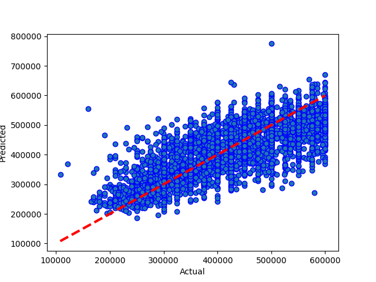
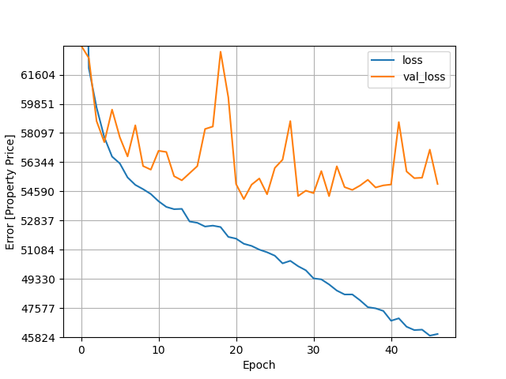

# Results from Neural Network m16 mega + dropout
### Dataset Version: 11
Date run: 2023-02-04 20:38:35.678921

Start time: 2023-02-04 20:35:11.967759

End time: 2023-02-04 20:38:35.222495

## Results
### Summary
saved (rather than pickled) new version of model
0.5764209140542647 is new best score (it's better than -999)

### Best Model: Comparing model predictions to actual property values

### Model Specific Notes
can't display hyperparameter comparison for neural network

can't display model performance graphs for neural network

can't display model performance graphs for neural network

### Neural Network Loss - Head
|    |    loss |   mean_squared_error |   val_loss |   val_mean_squared_error |   epoch |
|---:|--------:|---------------------:|-----------:|-------------------------:|--------:|
|  0 | 85438.9 |          1.61219e+10 |    63357.2 |              6.43761e+09 |       0 |
|  1 | 61996.2 |          6.17722e+09 |    62603.2 |              6.37146e+09 |       1 |
|  2 | 59630.1 |          5.77238e+09 |    58815.7 |              5.54988e+09 |       2 |
|  3 | 57840.3 |          5.45719e+09 |    57549.2 |              5.34037e+09 |       3 |
|  4 | 56679.8 |          5.25698e+09 |    59504.6 |              5.58222e+09 |       4 |

### Neural Network Loss - Tail
|    |    loss |   mean_squared_error |   val_loss |   val_mean_squared_error |   epoch |
|---:|--------:|---------------------:|-----------:|-------------------------:|--------:|
| 42 | 46459.9 |          3.86943e+09 |    55789.4 |              5.12273e+09 |      42 |
| 43 | 46258.1 |          3.8404e+09  |    55385.8 |              5.03422e+09 |      43 |
| 44 | 46283.9 |          3.84105e+09 |    55413.3 |              5.063e+09   |      44 |
| 45 | 45923.6 |          3.79326e+09 |    57099.7 |              5.31312e+09 |      45 |
| 46 | 46022.5 |          3.80343e+09 |    55036   |              5.01031e+09 |      46 |

### Model Structure
>Model: "sequential"
>________________________________________________________________________________________________________________________________________________________________
> Layer (type)                                                           Output Shape                                                    Param #                 
>
> normalization (Normalization)                                          (None, 83)                                                      167                     
>                                                                                                                                                                
> dense (Dense)                                                          (None, 128)                                                     10752                   
>                                                                                                                                                                
> dense_1 (Dense)                                                        (None, 256)                                                     33024                   
>                                                                                                                                                                
> activation (Activation)                                                multiple                                                        0                       
>                                                                                                                                                                
> dense_2 (Dense)                                                        (None, 512)                                                     131584                  
>                                                                                                                                                                
> dropout (Dropout)                                                      (None, 512)                                                     0                       
>                                                                                                                                                                
> dense_3 (Dense)                                                        (None, 1024)                                                    525312                  
>                                                                                                                                                                
> dense_4 (Dense)                                                        (None, 1024)                                                    1049600                 
>                                                                                                                                                                
> dropout_1 (Dropout)                                                    (None, 1024)                                                    0                       
>                                                                                                                                                                
> dense_5 (Dense)                                                        (None, 512)                                                     524800                  
>                                                                                                                                                                
> dense_6 (Dense)                                                        (None, 256)                                                     131328                  
>                                                                                                                                                                
> dense_7 (Dense)                                                        (None, 1)                                                       257                     
>                                                                                                                                                                
>
>Total params: 2,406,824
>Trainable params: 2,406,657
>Nontrainable params: 167
>________________________________________________________________________________________________________________________________________________________________

## Comparison with other models
### Comparison with version 11 performances
|                                         |   best score |   best time |   Mean Absolute Error Accuracy |   Mean Squared Error Accuracy |   R square Accuracy |   Root Mean Squared Error | best run date              | best method                                                       |
|:----------------------------------------|-------------:|------------:|-------------------------------:|------------------------------:|--------------------:|--------------------------:|:---------------------------|:------------------------------------------------------------------|
| neural network m16 mega + dropout (v11) |     0.576421 |      189.24 |                        54143.7 |                   4.78492e+09 |            0.576421 |                   69173.1 | 2023-02-04 20:38:32.549755 | loss=4.59e+04 valloss=5.41e+04 +valsplit=0.1 +patn=25 stop=47/400 |

### Comparison with all model performances
|                                         |   best score |   best time |   Mean Absolute Error Accuracy |   Mean Squared Error Accuracy |   R square Accuracy |   Root Mean Squared Error | best run date              | best method                                                       |
|:----------------------------------------|-------------:|------------:|-------------------------------:|------------------------------:|--------------------:|--------------------------:|:---------------------------|:------------------------------------------------------------------|
| neural network m16 mega + dropout (v11) |     0.576421 |      189.24 |                        54143.7 |                   4.78492e+09 |            0.576421 |                   69173.1 | 2023-02-04 20:38:32.549755 | loss=4.59e+04 valloss=5.41e+04 +valsplit=0.1 +patn=25 stop=47/400 |

## Appendix
### Data Sample
|     iddd |   Price |   bedrooms |   bathrooms |   nearestStation |   location.latitude |   location.longitude |   latitude_deviation |   longitude_deviation | tenure.tenureType   |   feature__1 bedroom |   feature__2 bedrooms |   feature__2 double bedrooms |   feature__allocated parking |   feature__allocated parking space |   feature__balcony |   feature__bathroom |   feature__chain free |   feature__close to local amenities |   feature__communal garden |   feature__communal gardens |   feature__double bedroom |   feature__double glazed |   feature__double glazing |   feature__epc rating c |   feature__epc rating d |   feature__excellent location |   feature__excellent transport links |   feature__family bathroom |   feature__first floor |   feature__fitted kitchen |   feature__garage |   feature__garden |   feature__gas central heating |   feature__great location |   feature__ground floor |   feature__kitchen |   feature__leasehold |   feature__long lease |   feature__modern bathroom |   feature__modern kitchen |   feature__no chain |   feature__no onward chain |   feature__off street parking |   feature__one bedroom |   feature__one double bedroom |   feature__parking |   feature__private balcony |   feature__private garden |   feature__private rear garden |   feature__reception room |   feature__separate kitchen |   feature__share of freehold |   feature__three bedrooms |   feature__three double bedrooms |   feature__top floor |   feature__two bathrooms |   feature__two bedrooms |   feature__two double bedrooms |   feature__two reception rooms |   feature__2__garden |   feature__2__central heating |   feature__2__parking |   feature__2__off road |   feature__2__shower |   feature__2__cavity wall insulation |   feature__2__wall insulation |   feature__2__insulation |   feature__2__insulat |   feature__2__dining room |   feature__2__garage |   feature__2__en-suite |   feature__2__en suite |   feature__2__penthouse |   feature__2__balcony |   feature__2__double-glazing |   feature__2__double glazing |   feature__2__off-road parking |   feature__2__security |   feature__2__patio |   feature__2__underfloor heating |   feature__2__marble |
|---------:|--------:|-----------:|------------:|-----------------:|--------------------:|---------------------:|---------------------:|----------------------:|:--------------------|---------------------:|----------------------:|-----------------------------:|-----------------------------:|-----------------------------------:|-------------------:|--------------------:|----------------------:|------------------------------------:|---------------------------:|----------------------------:|--------------------------:|-------------------------:|--------------------------:|------------------------:|------------------------:|------------------------------:|-------------------------------------:|---------------------------:|-----------------------:|--------------------------:|------------------:|------------------:|-------------------------------:|--------------------------:|------------------------:|-------------------:|---------------------:|----------------------:|---------------------------:|--------------------------:|--------------------:|---------------------------:|------------------------------:|-----------------------:|------------------------------:|-------------------:|---------------------------:|--------------------------:|-------------------------------:|--------------------------:|----------------------------:|-----------------------------:|--------------------------:|---------------------------------:|---------------------:|-------------------------:|------------------------:|-------------------------------:|-------------------------------:|---------------------:|------------------------------:|----------------------:|-----------------------:|---------------------:|-------------------------------------:|------------------------------:|-------------------------:|----------------------:|--------------------------:|---------------------:|-----------------------:|-----------------------:|------------------------:|----------------------:|-----------------------------:|-----------------------------:|-------------------------------:|-----------------------:|--------------------:|---------------------------------:|---------------------:|
| 14520525 |  550000 |          3 |           1 |         0.274316 |             51.5299 |            -0.20702  |             0.03023  |              0.1026   | LEASEHOLD           |                    0 |                     0 |                            0 |                            0 |                                  0 |                  0 |                   0 |                     0 |                                   0 |                          0 |                           0 |                         0 |                        0 |                         0 |                       0 |                       0 |                             0 |                                    0 |                          0 |                      0 |                         0 |                 0 |                 0 |                              0 |                         0 |                       0 |                  0 |                    1 |                     0 |                          0 |                         0 |                   0 |                          0 |                             0 |                      0 |                             0 |                  0 |                          1 |                         0 |                              0 |                         0 |                           1 |                            0 |                         0 |                                0 |                    0 |                        0 |                       0 |                              0 |                              0 |                    0 |                             0 |                     0 |                      0 |                    0 |                                    0 |                             0 |                        0 |                     0 |                         0 |                    0 |                      0 |                      0 |                       0 |                     1 |                            0 |                            0 |                              0 |                      0 |                   0 |                                0 |                    0 |
| 27953107 |  400000 |          2 |           2 |         0.305845 |             51.5494 |            -0.4826   |             0.04967  |              0.37818  | LEASEHOLD           |                    0 |                     0 |                            0 |                            1 |                                  0 |                  1 |                   0 |                     0 |                                   0 |                          0 |                           0 |                         0 |                        0 |                         0 |                       0 |                       0 |                             0 |                                    0 |                          1 |                      0 |                         0 |                 0 |                 0 |                              0 |                         0 |                       0 |                  0 |                    0 |                     0 |                          0 |                         0 |                   0 |                          0 |                             0 |                      0 |                             0 |                  0 |                          0 |                         0 |                              0 |                         0 |                           0 |                            0 |                         0 |                                0 |                    1 |                        0 |                       0 |                              1 |                              0 |                    0 |                             0 |                     1 |                      0 |                    0 |                                    0 |                             0 |                        0 |                     0 |                         0 |                    0 |                      1 |                      0 |                       0 |                     1 |                            0 |                            0 |                              0 |                      0 |                   0 |                                0 |                    0 |
| 33593487 |  579950 |          2 |           1 |         0.438045 |             51.4472 |            -0.33877  |             0.05254  |              0.23435  | FREEHOLD            |                    0 |                     0 |                            1 |                            0 |                                  0 |                  0 |                   0 |                     0 |                                   0 |                          0 |                           0 |                         0 |                        0 |                         0 |                       0 |                       0 |                             0 |                                    0 |                          0 |                      0 |                         0 |                 0 |                 0 |                              0 |                         0 |                       0 |                  0 |                    0 |                     0 |                          0 |                         0 |                   0 |                          1 |                             0 |                      0 |                             0 |                  0 |                          0 |                         0 |                              0 |                         0 |                           0 |                            0 |                         0 |                                0 |                    0 |                        0 |                       0 |                              0 |                              0 |                    1 |                             0 |                     0 |                      0 |                    0 |                                    0 |                             0 |                        0 |                     0 |                         1 |                    0 |                      0 |                      0 |                       0 |                     0 |                            0 |                            0 |                              0 |                      0 |                   0 |                                0 |                    0 |
| 35271294 |  370000 |          2 |           1 |         0.399307 |             51.4496 |            -0.140154 |             0.050152 |              0.035734 | LEASEHOLD           |                    0 |                     0 |                            0 |                            0 |                                  0 |                  1 |                   0 |                     0 |                                   0 |                          0 |                           0 |                         0 |                        0 |                         1 |                       0 |                       0 |                             0 |                                    0 |                          0 |                      0 |                         0 |                 0 |                 0 |                              0 |                         1 |                       0 |                  0 |                    0 |                     0 |                          0 |                         0 |                   0 |                          0 |                             0 |                      0 |                             0 |                  0 |                          0 |                         0 |                              0 |                         0 |                           0 |                            0 |                         0 |                                0 |                    0 |                        0 |                       0 |                              0 |                              0 |                    0 |                             0 |                     0 |                      0 |                    0 |                                    0 |                             0 |                        0 |                     0 |                         0 |                    0 |                      0 |                      0 |                       0 |                     1 |                            0 |                            1 |                              0 |                      0 |                   0 |                                0 |                    0 |
| 44749111 |  475000 |          2 |           1 |         0.41055  |             51.37   |            -0.21241  |             0.12967  |              0.10799  | FREEHOLD            |                    0 |                     0 |                            0 |                            0 |                                  0 |                  0 |                   0 |                     0 |                                   0 |                          0 |                           0 |                         0 |                        0 |                         0 |                       0 |                       0 |                             0 |                                    0 |                          0 |                      0 |                         1 |                 0 |                 0 |                              0 |                         0 |                       0 |                  0 |                    0 |                     0 |                          0 |                         0 |                   0 |                          0 |                             0 |                      0 |                             0 |                  0 |                          0 |                         0 |                              0 |                         0 |                           0 |                            0 |                         0 |                                0 |                    0 |                        0 |                       0 |                              0 |                              0 |                    1 |                             0 |                     0 |                      0 |                    1 |                                    0 |                             0 |                        0 |                     0 |                         0 |                    0 |                      0 |                      0 |                       0 |                     0 |                            0 |                            1 |                              0 |                      0 |                   0 |                                0 |                    0 |

### Environment Variables
notebook_environment = gradient

use_gpu = True

debug_mode = False

quick_mode = False

quick_override_cv_splits = 2

quick_override_n_iter = 10

quick_override_n_jobs = 3

### Useful info
Tensorflow version: 2.9.1

