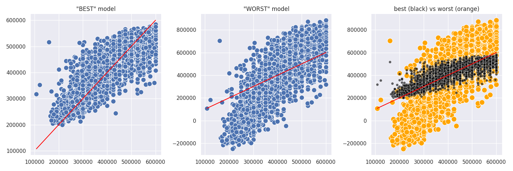
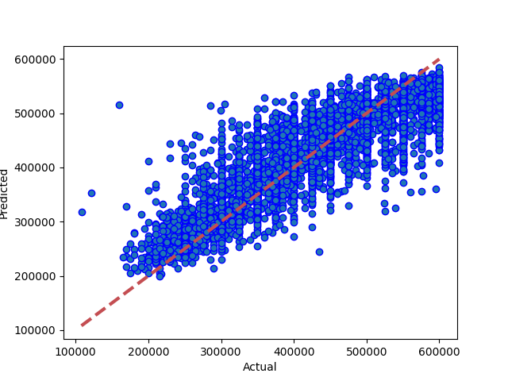
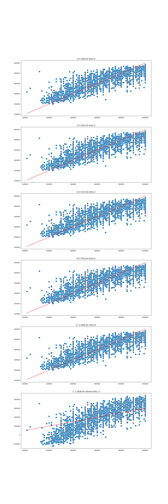

# Results from Stacked Model
### Dataset Version: 06
Date run: 2023-02-07 11:11:42.501775

Start time: 2023-02-07 10:59:42.231291

End time: 2023-02-07 11:11:42.501766

## Results
### Summary
pickled new version of model
0.7306447700523587 is new best score (it's better than -999)

### Tuned Models ranked by performance, with parameter details
|   rank_test_score |   mean_test_score |   mean_fit_time |   mean_score_time | param_model__xgb1__tree_method   |   param_model__xgb1__subsample |   param_model__xgb1__n_estimators |   param_model__xgb1__min_samples_leaf |   param_model__xgb1__max_samples |   param_model__xgb1__max_leaf_nodes |   param_model__xgb1__max_features |   param_model__xgb1__max_depth |   param_model__xgb1__learning_rate |   param_model__xgb1__lambda |   param_model__xgb1__colsample_bytree | param_model__xgb1__booster   |   param_model__n_jobs |   param_model__lgb1__num_leaves |   param_model__lgb1__num_iterations |   param_model__lgb1__n_estimators |   param_model__lgb1__min_child_samples | param_model__lgb1__metric   |   param_model__lgb1__learning_rate | param_model__lgb1__is_unbalance   |   param_model__lgb1__colsample_bytree | param_model__lgb1__boosting_type   | param_model__knn1__weights   |   param_model__knn1__p |   param_model__knn1__n_neighbors | param_model__knn1__metric   |   param_model__knn1__leaf_size | params2                                                                                                         |
|------------------:|------------------:|----------------:|------------------:|:---------------------------------|-------------------------------:|----------------------------------:|--------------------------------------:|---------------------------------:|------------------------------------:|----------------------------------:|-------------------------------:|-----------------------------------:|----------------------------:|--------------------------------------:|:-----------------------------|----------------------:|--------------------------------:|------------------------------------:|----------------------------------:|---------------------------------------:|:----------------------------|-----------------------------------:|:----------------------------------|--------------------------------------:|:-----------------------------------|:-----------------------------|-----------------------:|---------------------------------:|:----------------------------|-------------------------------:|:----------------------------------------------------------------------------------------------------------------|
|                 1 |          0.707175 |        27.7347  |           4.6943  | auto                             |                           0.5  |                                50 |                                    20 |                             1    |                                  20 |                                64 |                             10 |                                0.1 |                           1 |                                  1    | dart                         |                     6 |                              20 |                                 100 |                               132 |                                     20 | auc                         |                               0.5  | True                              |                                   0.6 | goss                               | distance                     |                      1 |                                9 | minkowski                   |                              3 | auto/0.5/50/20/1/20/64/10/0.1/1/1/dart/6/20/100/132/20/auc/0.5/True/0.6/goss/distance/1/9/minkowski/3           |
|                 2 |          0.703976 |        20.7608  |           1.7198  | auto                             |                           0.5  |                                50 |                                    50 |                             0.75 |                                   2 |                                64 |                             10 |                                0.1 |                             |                                  0.9  | dart                         |                     6 |                              20 |                                 100 |                               132 |                                     20 | auc                         |                               0.5  | False                             |                                   0.6 | dart                               | distance                     |                      2 |                                9 | minkowski                   |                             90 | auto/0.5/50/50/0.75/2/64/10/0.1/None/0.9/dart/6/20/100/132/20/auc/0.5/False/0.6/dart/distance/2/9/minkowski/90  |
|                 3 |          0.701185 |         9.37313 |           4.73109 | auto                             |                           0.5  |                                20 |                                    50 |                             0.9  |                                  20 |                                   |                             10 |                                0.1 |                             |                                  0.75 | dart                         |                     6 |                              20 |                                  50 |                                64 |                                     20 | auc                         |                               0.05 | False                             |                                   0.6 | gbdt                               | distance                     |                      1 |                                9 | minkowski                   |                              3 | auto/0.5/20/50/0.9/20/None/10/0.1/None/0.75/dart/6/20/50/64/20/auc/0.05/False/0.6/gbdt/distance/1/9/minkowski/3 |
|                 4 |          0.697374 |        18.3795  |           1.48265 | auto                             |                           0.9  |                                50 |                                    20 |                             0.9  |                                   2 |                                   |                             10 |                                0.1 |                          50 |                                  0.75 | dart                         |                     6 |                              20 |                                  50 |                               132 |                                     20 | auc                         |                               0.5  | True                              |                                   0.6 | dart                               | distance                     |                      2 |                                7 | minkowski                   |                             30 | auto/0.9/50/20/0.9/2/None/10/0.1/50/0.75/dart/6/20/50/132/20/auc/0.5/True/0.6/dart/distance/2/7/minkowski/30    |
|                 5 |          0.696849 |        16.4281  |           5.34125 | auto                             |                           0.9  |                                20 |                                    20 |                             0.75 |                                  20 |                                   |                             10 |                                0.1 |                          50 |                                  0.9  | dart                         |                     6 |                              20 |                                 100 |                                64 |                                     20 | auc                         |                               0.05 | False                             |                                   0.6 | dart                               | distance                     |                      1 |                               11 | minkowski                   |                              3 | auto/0.9/20/20/0.75/20/None/10/0.1/50/0.9/dart/6/20/100/64/20/auc/0.05/False/0.6/dart/distance/1/11/minkowski/3 |
|                 6 |          0.694646 |        20.9989  |           3.6956  | auto                             |                           0.75 |                                50 |                                    20 |                             0.9  |                                  20 |                                64 |                             10 |                                0.1 |                          50 |                                  1    | dart                         |                     6 |                              20 |                                  25 |                                64 |                                     20 | auc                         |                               0.05 | True                              |                                   0.6 | gbdt                               | distance                     |                      2 |                               11 | minkowski                   |                              3 | auto/0.75/50/20/0.9/20/64/10/0.1/50/1/dart/6/20/25/64/20/auc/0.05/True/0.6/gbdt/distance/2/11/minkowski/3       |
|                 7 |          0.689393 |        20.0917  |           3.10507 | auto                             |                           0.9  |                                50 |                                    20 |                             0.9  |                                   2 |                                64 |                             10 |                                0.1 |                             |                                  0.75 | dart                         |                     6 |                              20 |                                  50 |                                64 |                                     20 | auc                         |                               0.05 | False                             |                                   0.6 | goss                               | distance                     |                      2 |                                7 | minkowski                   |                              3 | auto/0.9/50/20/0.9/2/64/10/0.1/None/0.75/dart/6/20/50/64/20/auc/0.05/False/0.6/goss/distance/2/7/minkowski/3    |
### Best and worst models obtained by tuning

### Best Model: Comparing model predictions to actual property values

## Comparison with other models
### Comparison with version 06 performances
|                     |   best score |   best time |   Mean Absolute Error Accuracy |   Mean Squared Error Accuracy |   R square Accuracy |   Root Mean Squared Error | best run date              | best method   |
|:--------------------|-------------:|------------:|-------------------------------:|------------------------------:|--------------------:|--------------------------:|:---------------------------|:--------------|
| stacked model (v06) |     0.730645 |     18.9232 |                        41910.6 |                   3.04275e+09 |            0.730645 |                   55161.1 | 2023-02-07 11:11:42.105711 | random search |
### Comparison with all model performances
|                     |   best score |   best time |   Mean Absolute Error Accuracy |   Mean Squared Error Accuracy |   R square Accuracy |   Root Mean Squared Error | best run date              | best method   |
|:--------------------|-------------:|------------:|-------------------------------:|------------------------------:|--------------------:|--------------------------:|:---------------------------|:--------------|
| stacked model (v06) |     0.730645 |     18.9232 |                        41910.6 |                   3.04275e+09 |            0.730645 |                   55161.1 | 2023-02-07 11:11:42.105711 | random search |
## Appendix
### Data Sample
|          |   Price |   bedrooms |   bathrooms |   nearestStation |   location.latitude |   location.longitude |   latitude_deviation |   longitude_deviation | tenure.tenureType   |
|---------:|--------:|-----------:|------------:|-----------------:|--------------------:|---------------------:|---------------------:|----------------------:|:--------------------|
| 14520525 |  550000 |          3 |           1 |         0.274316 |             51.5299 |            -0.20702  |             0.03023  |              0.1026   | LEASEHOLD           |
| 27953107 |  400000 |          2 |           2 |         0.305845 |             51.5494 |            -0.4826   |             0.04967  |              0.37818  | LEASEHOLD           |
| 33593487 |  579950 |          2 |           1 |         0.438045 |             51.4472 |            -0.33877  |             0.05254  |              0.23435  | FREEHOLD            |
| 35271294 |  370000 |          2 |           1 |         0.399307 |             51.4496 |            -0.140154 |             0.050152 |              0.035734 | LEASEHOLD           |
| 44749111 |  475000 |          2 |           1 |         0.41055  |             51.37   |            -0.21241  |             0.12967  |              0.10799  | FREEHOLD            |
### Hyperparameter options for Randomized Grid Search
model__n_jobs = [6]

model__xgb1__subsample = [0.5, 0.75, 0.9]

model__xgb1__n_estimators = [20, 50]

model__xgb1__min_samples_leaf = [20, 50]

model__xgb1__max_depth = [10]

model__xgb1__learning_rate = [0.1]

model__xgb1__booster = ['dart']

model__xgb1__lambda = [None, 1, 10, 50]

model__xgb1__tree_method = ['auto']

model__xgb1__colsample_bytree = [1, 0.75, 0.9]

model__xgb1__max_leaf_nodes = [2, 20]

model__xgb1__max_samples = [1, 0.75, 0.9]

model__xgb1__max_features = [None, 16, 64]

model__knn1__leaf_size = [3, 30, 60, 90]

model__knn1__metric = ['minkowski']

model__knn1__n_neighbors = [7, 9, 11]

model__knn1__p = [1, 2]

model__knn1__weights = ['distance']

model__lgb1__boosting_type = ['gbdt', 'rf', 'dart', 'goss']

model__lgb1__colsample_bytree = [0.6]

model__lgb1__is_unbalance = [True, False]

model__lgb1__learning_rate = [0.05, 0.5]

model__lgb1__metric = ['auc']

model__lgb1__min_child_samples = [20]

model__lgb1__n_estimators = [64, 132]

model__lgb1__num_iterations = [25, 50, 100]

model__lgb1__num_leaves = [20]

### Range of hyperparameter results

### Environment Variables
notebook_environment = gradient

use_gpu = True

debug_mode = False

quick_mode = False

quick_override_cv_splits = 2

quick_override_n_iter = 10

quick_override_n_jobs = 3

