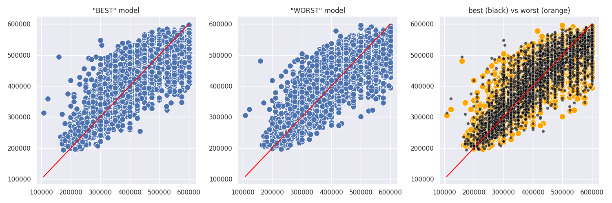
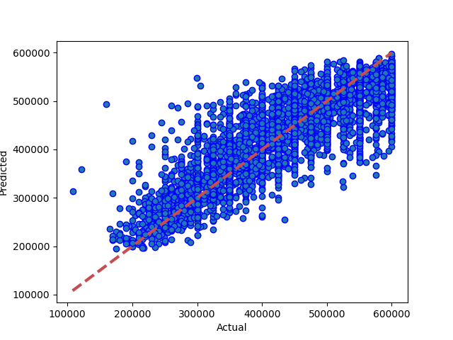
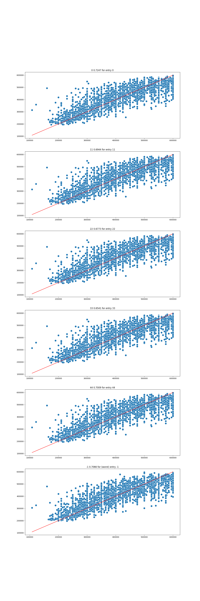

# Results from Stacked Model
### Dataset Version: 09
Date run: 2023-02-07 17:40:03.932194

Start time: 2023-02-07 15:40:05.305526

End time: 2023-02-07 17:40:03.932182

## Results
### Summary
pickled new version of model
0.7246700333076852 is new best score (it's better than -999)

### Tuned Models ranked by performance, with parameter details
|   rank_test_score |   mean_test_score |   mean_fit_time |   mean_score_time | param_model__xgb1__tree_method   |   param_model__xgb1__subsample |   param_model__xgb1__n_estimators |   param_model__xgb1__min_samples_leaf |   param_model__xgb1__max_samples |   param_model__xgb1__max_leaf_nodes |   param_model__xgb1__max_features |   param_model__xgb1__max_depth |   param_model__xgb1__learning_rate |   param_model__xgb1__lambda |   param_model__xgb1__colsample_bytree | param_model__xgb1__booster   |   param_model__n_jobs |   param_model__lgb1__num_leaves |   param_model__lgb1__num_iterations |   param_model__lgb1__n_estimators |   param_model__lgb1__min_child_samples | param_model__lgb1__metric   |   param_model__lgb1__learning_rate | param_model__lgb1__is_unbalance   |   param_model__lgb1__colsample_bytree | param_model__lgb1__boosting_type   | param_model__knn1__weights   |   param_model__knn1__p |   param_model__knn1__n_neighbors | param_model__knn1__metric   |   param_model__knn1__leaf_size | params2                                                                                                           |
|------------------:|------------------:|----------------:|------------------:|:---------------------------------|-------------------------------:|----------------------------------:|--------------------------------------:|---------------------------------:|------------------------------------:|----------------------------------:|-------------------------------:|-----------------------------------:|----------------------------:|--------------------------------------:|:-----------------------------|----------------------:|--------------------------------:|------------------------------------:|----------------------------------:|---------------------------------------:|:----------------------------|-----------------------------------:|:----------------------------------|--------------------------------------:|:-----------------------------------|:-----------------------------|-----------------------:|---------------------------------:|:----------------------------|-------------------------------:|:------------------------------------------------------------------------------------------------------------------|
|                 1 |          0.707063 |         53.4998 |           4.06365 | auto                             |                           0.5  |                                50 |                                    50 |                             0.9  |                                 100 |                                   |                             20 |                               0.1  |                             |                                  0.9  | dart                         |                     6 |                              20 |                                 100 |                               132 |                                     40 | auc                         |                               0.5  | False                             |                                   0.6 | dart                               | distance                     |                      1 |                               11 | minkowski                   |                              3 | auto/0.5/50/50/0.9/100/None/20/0.1/None/0.9/dart/6/20/100/132/40/auc/0.5/False/0.6/dart/distance/1/11/minkowski/3 |
|                 2 |          0.700886 |         39.4242 |           1.15298 | auto                             |                           0.75 |                                50 |                                    20 |                             0.75 |                                   2 |                                16 |                             20 |                               0.1  |                        10   |                                  1    | dart                         |                     6 |                              10 |                                  25 |                               132 |                                     10 | auc                         |                               0.05 | False                             |                                   0.6 | gbdt                               | distance                     |                      2 |                                9 | minkowski                   |                             90 | auto/0.75/50/20/0.75/2/16/20/0.1/10/1/dart/6/10/25/132/10/auc/0.05/False/0.6/gbdt/distance/2/9/minkowski/90       |
|                 3 |          0.69906  |         60.4285 |           4.4482  | auto                             |                           0.75 |                                50 |                                    50 |                             1    |                                   2 |                               132 |                             20 |                               0.01 |                         0.5 |                                  1    | dart                         |                     6 |                              50 |                                 200 |                               132 |                                     20 | auc                         |                               0.5  | False                             |                                   0.6 | dart                               | distance                     |                      1 |                                7 | minkowski                   |                            180 | auto/0.75/50/50/1/2/132/20/0.01/0.5/1/dart/6/50/200/132/20/auc/0.5/False/0.6/dart/distance/1/7/minkowski/180      |
|                 4 |          0.690123 |         27.828  |           1.5201  | auto                             |                           0.75 |                                50 |                                    20 |                             0.9  |                                   2 |                                   |                             10 |                               0.1  |                         0.5 |                                  1    | dart                         |                     6 |                              50 |                                  25 |                               264 |                                     40 | auc                         |                               0.05 | False                             |                                   0.6 | gbdt                               | distance                     |                      2 |                                7 | minkowski                   |                             30 | auto/0.75/50/20/0.9/2/None/10/0.1/0.5/1/dart/6/50/25/264/40/auc/0.05/False/0.6/gbdt/distance/2/7/minkowski/30     |
|                 5 |          0.689586 |         31.7535 |           4.44761 | auto                             |                           0.5  |                                50 |                                    20 |                             1    |                                   2 |                                   |                             10 |                               0.01 |                         0.5 |                                  0.75 | dart                         |                     6 |                              50 |                                 100 |                                64 |                                     20 | auc                         |                               0.5  | True                              |                                   0.6 | gbdt                               | distance                     |                      1 |                               11 | minkowski                   |                              3 | auto/0.5/50/20/1/2/None/10/0.01/0.5/0.75/dart/6/50/100/64/20/auc/0.5/True/0.6/gbdt/distance/1/11/minkowski/3      |
|                 6 |          0.687959 |         29.2932 |           1.50013 | auto                             |                           0.9  |                                50 |                                    50 |                             1    |                                 100 |                                   |                             10 |                               0.1  |                        10   |                                  1    | dart                         |                     6 |                              50 |                                 100 |                               264 |                                     40 | auc                         |                               0.5  | True                              |                                   0.6 | dart                               | distance                     |                      2 |                                7 | minkowski                   |                             30 | auto/0.9/50/50/1/100/None/10/0.1/10/1/dart/6/50/100/264/40/auc/0.5/True/0.6/dart/distance/2/7/minkowski/30        |
|                 7 |          0.687053 |         24.8522 |           1.25721 | auto                             |                           0.9  |                                50 |                                    20 |                             0.75 |                                   2 |                               132 |                             10 |                               0.01 |                             |                                  0.9  | dart                         |                     6 |                              50 |                                 100 |                                64 |                                     20 | auc                         |                               0.5  | False                             |                                   0.6 | gbdt                               | distance                     |                      2 |                                7 | minkowski                   |                             90 | auto/0.9/50/20/0.75/2/132/10/0.01/None/0.9/dart/6/50/100/64/20/auc/0.5/False/0.6/gbdt/distance/2/7/minkowski/90   |
### Best and worst models obtained by tuning

### Best Model: Comparing model predictions to actual property values

## Comparison with other models
### Comparison with version 09 performances
|                     |   best score |   best time |   Mean Absolute Error Accuracy |   Mean Squared Error Accuracy |   R square Accuracy |   Root Mean Squared Error | best run date              | best method   |
|:--------------------|-------------:|------------:|-------------------------------:|------------------------------:|--------------------:|--------------------------:|:---------------------------|:--------------|
| stacked model (v09) |      0.72467 |     41.6449 |                        42158.2 |                   3.11024e+09 |             0.72467 |                   55769.5 | 2023-02-07 17:40:03.460831 | random search |
### Comparison with all model performances
|                     |   best score |   best time |   Mean Absolute Error Accuracy |   Mean Squared Error Accuracy |   R square Accuracy |   Root Mean Squared Error | best run date              | best method   |
|:--------------------|-------------:|------------:|-------------------------------:|------------------------------:|--------------------:|--------------------------:|:---------------------------|:--------------|
| stacked model (v09) |      0.72467 |     41.6449 |                        42158.2 |                   3.11024e+09 |             0.72467 |                   55769.5 | 2023-02-07 17:40:03.460831 | random search |
## Appendix
### Data Sample
|          |   Price |   bedrooms |   bathrooms |   nearestStation |   location.latitude |   location.longitude |   latitude_deviation |   longitude_deviation | tenure.tenureType   |   feature__balcony |   feature__chain free |   feature__no onward chain |   feature__off street parking |   feature__one bedroom |   feature__private balcony |   feature__share of freehold |   feature__three bedrooms |   feature__two bedrooms |   feature__two double bedrooms |
|---------:|--------:|-----------:|------------:|-----------------:|--------------------:|---------------------:|---------------------:|----------------------:|:--------------------|-------------------:|----------------------:|---------------------------:|------------------------------:|-----------------------:|---------------------------:|-----------------------------:|--------------------------:|------------------------:|-------------------------------:|
| 14520525 |  550000 |          3 |           1 |         0.274316 |             51.5299 |            -0.20702  |             0.03023  |              0.1026   | LEASEHOLD           |                  0 |                     0 |                          0 |                             0 |                      0 |                          1 |                            0 |                         0 |                       0 |                              0 |
| 27953107 |  400000 |          2 |           2 |         0.305845 |             51.5494 |            -0.4826   |             0.04967  |              0.37818  | LEASEHOLD           |                  1 |                     0 |                          0 |                             0 |                      0 |                          0 |                            0 |                         0 |                       0 |                              1 |
| 33593487 |  579950 |          2 |           1 |         0.438045 |             51.4472 |            -0.33877  |             0.05254  |              0.23435  | FREEHOLD            |                  0 |                     0 |                          1 |                             0 |                      0 |                          0 |                            0 |                         0 |                       0 |                              0 |
| 35271294 |  370000 |          2 |           1 |         0.399307 |             51.4496 |            -0.140154 |             0.050152 |              0.035734 | LEASEHOLD           |                  1 |                     0 |                          0 |                             0 |                      0 |                          0 |                            0 |                         0 |                       0 |                              0 |
| 44749111 |  475000 |          2 |           1 |         0.41055  |             51.37   |            -0.21241  |             0.12967  |              0.10799  | FREEHOLD            |                  0 |                     0 |                          0 |                             0 |                      0 |                          0 |                            0 |                         0 |                       0 |                              0 |
### Hyperparameter options for Randomized Grid Search
model__n_jobs = [6]

model__xgb1__tree_method = ['auto']

model__xgb1__subsample = [0.5, 0.75, 0.9]

model__xgb1__n_estimators = [50, 100]

model__xgb1__min_samples_leaf = [20, 50]

model__xgb1__max_samples = [1, 0.75, 0.9]

model__xgb1__max_leaf_nodes = [2, 20, 100]

model__xgb1__max_features = [None, 16, 64, 132]

model__xgb1__max_depth = [10, 20]

model__xgb1__learning_rate = [0.01, 0.1, 1]

model__xgb1__lambda = [None, 0.5, 1, 10]

model__xgb1__colsample_bytree = [1, 0.75, 0.9]

model__xgb1__booster = ['dart']

model__lgb1__num_leaves = [10, 20, 50]

model__lgb1__num_iterations = [25, 50, 100, 200]

model__lgb1__n_estimators = [64, 132, 264]

model__lgb1__min_child_samples = [10, 20, 40]

model__lgb1__metric = ['auc']

model__lgb1__learning_rate = [0.05, 0.5]

model__lgb1__is_unbalance = [True, False]

model__lgb1__colsample_bytree = [0.6]

model__lgb1__boosting_type = ['gbdt', 'dart']

model__knn1__weights = ['distance']

model__knn1__p = [1, 2]

model__knn1__n_neighbors = [7, 9, 11]

model__knn1__metric = ['minkowski']

model__knn1__leaf_size = [3, 30, 60, 90, 180]

### Range of hyperparameter results

### Environment Variables
notebook_environment = gradient

use_gpu = True

debug_mode = False

quick_mode = False

quick_override_cv_splits = 2

quick_override_n_iter = 10

quick_override_n_jobs = 3

